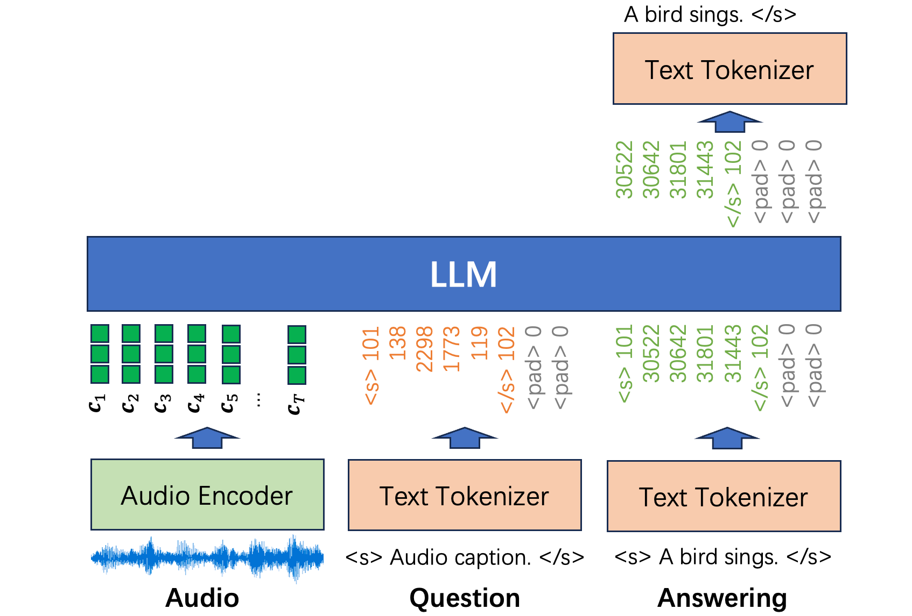

# Audio Understanding with Large Language Models

This repository contains a tutorial of building audio understanding systems with large language models (LLMs). The audio understanding tasks include automatic speech recogntion (ASR), audio caption, audio query answering, music transcription, etc. The repository is written in PyTorch. All tasks are formatted to a same format with tuples of audio, question, and answering as input. An audio understanding system consists of an audio encoder and an LLM decoder. When loading pretrained audio encoders and train LLM decoders from scratch, users can train an audio understanding system in less than 10 hours using a single RTX 4090 GPU.



## 0. Install dependencies

```bash
# Clone the repo
git clone https://github.com/qiuqiangkong/audio_understanding
cd audio_understanding

# Install Python environment
conda create --name audio_understanding python=3.10

# Activate environment
conda activate audio_understanding

# Install Python packages dependencies
bash env.sh
```

## 1. Train and Inference

### 1.1 Music tagging

To train a music tagging system, users need to do download the GTZAN dataset (1.3 GB, 8 hours)

```bash
bash ./scripts/download_gtzan.sh
```

```python
# Train (Takes ~3 hours on 1 RTX4090 to train for 100,000 steps)
CUDA_VISIBLE_DEVICES=0 python train.py --config="./configs/music_tagging_gtzan.yaml"

# Inference
CUDA_VISIBLE_DEVICES=0 python inference.py \
	--config="./configs/music_tagging_gtzan.yaml" \
	--ckpt_path="./checkpoints/train/music_tagging_gtzan/step=100000.pth" \
	--audio_path="./assets/audios/gtzan_blues.00002.au"
```

Inference results by using the 100,000 steps checkpoint:

| Task                | Training Dataset            | Loss                                                                                       | Test audio                                                                                 | Output   |
|---------------------|-----------------------------|--------------------------------------------------------------------------------------------|--------------------------------------------------------------------------------------------|----------|
| Music Tagging       | GTZAN (size: 8 h)           |  | <video src=https://github.com/user-attachments/assets/3525bf28-59f6-49f0-b6b6-de86d86c719f> | blues    |


### 1.2 Automatic speech recognition (ASR)

To train an ASR system, users need to do download the LibriSpeech dataset (1,000 hours)

```bash
bash ./scripts/download_librispeech.sh
```

```python
# Train (Takes ~8 hours on 1 RTX4090 to train for 100,000 steps)
CUDA_VISIBLE_DEVICES=0 python train.py --config="./configs/asr_librispeech.yaml"

# Inference
CUDA_VISIBLE_DEVICES=0 python inference.py \
	--config="./configs/asr_librispeech.yaml" \
	--ckpt_path="./checkpoints/train/asr_librispeech/step=100000.pth" \
	--audio_path="./assets/audios/librispeech_1688-142285-0000.flac"
```

Inference results by using the 100,000 steps checkpoint:

| Task                | Training Dataset            | Loss                                                                                       | Test audio                                                                                 | Output  |
|---------------------|-----------------------------|--------------------------------------------------------------------------------------------|--------------------------------------------------------------------------------------------|---------|
| ASR                 | LibriSpeech (size: 1,000 h) |  | <video src=https://github.com/user-attachments/assets/f14973a9-8d2a-4658-929f-b9d71ed9d216> | there ' s iron they say in all our blood and a grain or two perhaps is good but his he makes me harshly feel has got a little too much of steel anon |

### 1.3 Audio Caption
```bash
bash ./scripts/download_clotho.sh
```

```python
# Train (takes ~8 hours on 1 RTX4090 to train for 100,000 steps)
CUDA_VISIBLE_DEVICES=0 python train.py --config="./configs/audio_caption_clotho.yaml"

# Inference
CUDA_VISIBLE_DEVICES=0 python inference.py \
	--config="./configs/audio_caption_clotho.yaml" \
	--ckpt_path="./checkpoints/train/audio_caption_clotho/step=100000.pth" \
	--audio_path="./assets/audios/clotho_birds_long.wav"
```

Inference results by using the 100,000 steps checkpoint:

| Task                | Training Dataset            | Loss                                                                                       | Test audio                                                                                 | Output  |
|---------------------|-----------------------------|--------------------------------------------------------------------------------------------|--------------------------------------------------------------------------------------------|---------|
| Audio Caption       | Clotho (size: 24 h)         |  | <video src=https://github.com/user-attachments/assets/696a7fd8-f738-4002-bc90-fe9275a143a6> | birds chirping and a passing of a car outdoors |


### 1.4 Piano Transcription
```bash
bash ./scripts/download_maestro.sh
```

```python
# Train (takes ~8 hours on 1 RTX4090 to train for 100,000 steps)
CUDA_VISIBLE_DEVICES=0 python train.py --config="./configs/piano_transcription_maestro.yaml"

# Inference
CUDA_VISIBLE_DEVICES=0 python inference.py \
	--config="./configs/piano_transcription_maestro.yaml" \
	--ckpt_path="./checkpoints/train/piano_transcription_maestro/step=100000.pth" \
	--audio_path="./assets/audios/cut_liszt_5s.mp3"
```

Inference results by using the 100,000 steps checkpoint:

| Task                | Training Dataset            | Loss                                                                                       | Test audio                                                                                 | Output  |
|---------------------|-----------------------------|--------------------------------------------------------------------------------------------|--------------------------------------------------------------------------------------------|---------|
| Piano Transcription | MAESTRO (199 h)             |  | <video src=https://github.com/user-attachments/assets/65297909-ac4d-4abc-a69c-35d870361064> | <video src=https://github.com/user-attachments/assets/76e4d3f1-ea7d-4c9f-8298-6eb5ce016a84> |

## 2. Train on Multiple GPUs.

We use Huggingface accelerate library to train the systems on multiple GPUs. train_accelerate.py just adds a few lines to train.py. Here is an example to run with 4 GPUs:

```python
CUDA_VISIBLE_DEVICES=0,1,2,3 accelerate launch --multi_gpu --num_processes 4 train_accelerate.py --config="./configs/asr_librispeech.yaml"
```

Loss comparison between training with 1 GPU and 4 GPUs. The training will speed up by 4 times.

| Task                | Training Dataset            | Train loss                                                                                       | Test loss                                                                                 |
|---------------------|-----------------------------|--------------------------------------------------------------------------------------------|--------------------------------------------------------------------------------------------|
| ASR                 | LibriSpeech (size: 1,000 h) |  |  |

## External links

The Llama model code is from: https://github.com/qiuqiangkong/mini_llm/blob/main/models/llama.py

## License

MIT

## Cite
<pre>
@article{kong2020panns,
  title={Panns: Large-scale pretrained audio neural networks for audio pattern recognition},
  author={Kong, Qiuqiang and Cao, Yin and Iqbal, Turab and Wang, Yuxuan and Wang, Wenwu and Plumbley, Mark D},
  journal={IEEE/ACM Transactions on Audio, Speech, and Language Processing},
  volume={28},
  pages={2880--2894},
  year={2020},
  publisher={IEEE}
}
</pre>
